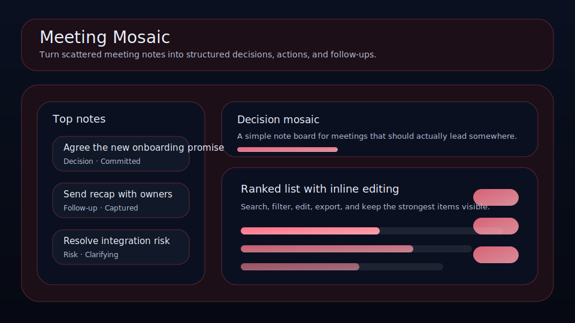

# Meeting Mosaic

Turn scattered meeting notes into structured decisions, actions, and follow-ups.



Meeting Mosaic is a local-first workspace for founders, operators, and solo builders who want a cleaner way to manage meeting fragments. It keeps clarity, owner, next move, and review timing visible so the right things move forward with less drift.

## What it does

- ranks meeting fragments by leverage, clarity, timing, and friction
- tracks **owner**, **next move**, **follow-up date**, and **clarity** for each meeting fragment
- highlights the best current bet, the next review slot, and the strongest signal on the board
- renders a dedicated queue plus a category mix snapshot beneath the main board
- saves locally in the browser with JSON import/export backups
- quick action: **Queue follow-up**
- quick action: **Sharpen clarity**
- quick action: **Mark closed**

## Why it feels different

Meeting Mosaic is not just a generic list. It is shaped around the real workflow behind meeting fragments, so the board helps you decide what matters next instead of simply storing records.

## Quick start

```bash
git clone https://github.com/get2salam/meeting-mosaic.git
cd meeting-mosaic
python -m http.server 8000
```

Then open <http://localhost:8000>.

## Keyboard shortcuts

- `N` creates a new meeting fragment
- `/` focuses the search box

## Privacy

Everything stays in your browser unless you export a JSON backup.

## License

MIT
